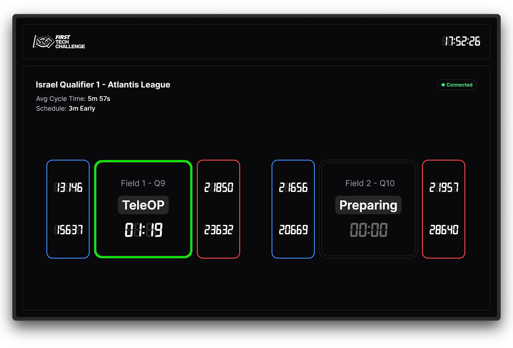

# FTC FTA Dashboard

**FTC FTA Dashboard** is a web-based tool designed for _FIRST_ Tech Challenge FTAs to monitor event fields in real time. It integrates with the **FTC Live Scorekeeper Software** and provides a smooth user experience.

<p align="center">
  <a href="https://ftc-fta-dashboard.vercel.app" target="_blank" rel="noopener noreferrer">
    
  </a>
</p>

## Getting Started

The dashboard is a web application, available at **[ftc-fta-dashboard.vercel.app](https://ftc-fta-dashboard.vercel.app)**.

## Development

This is a Next.js project, built with Tailwind CSS and shadcn/ui.

To get started, clone the repository,, install dependencies and run the development server:

```bash
bun install
bun dev
```

Open [http://localhost:3000](http://localhost:3000) with your browser to see the application.

## Contributing

Contributions are welcome! Please submit a pull request or open an issue if you have suggestions for improvements.
